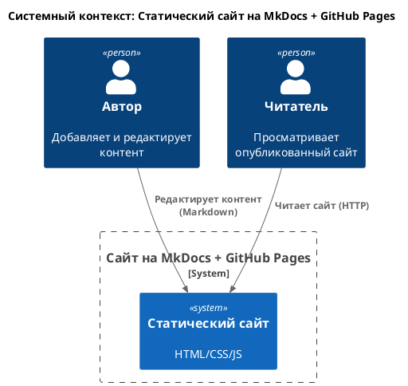
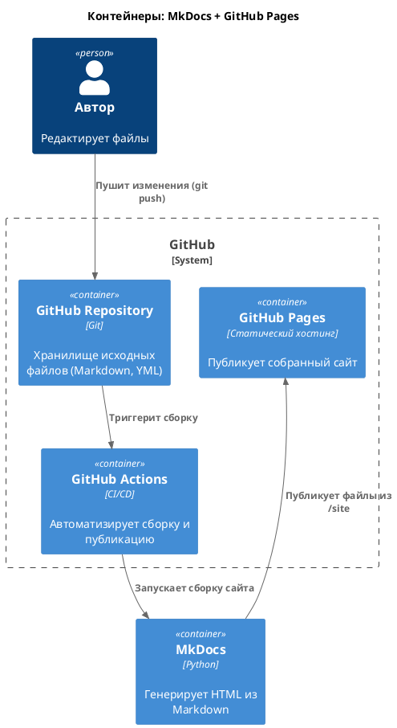
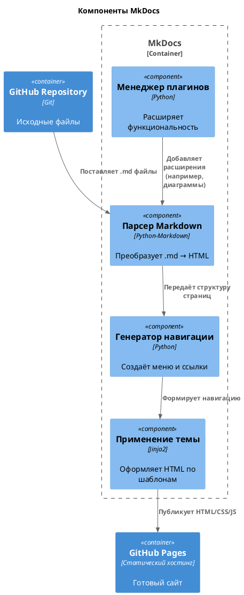

# Как этот сайт устроен?
## 1. Обзор системы
Связка MkDocs и GitHub Pages — это инструмент для создания и публикации статических сайтов (например, документации, блогов, портфолио) без необходимости управлять серверами или базами данных.

### 1.1. Преимущества архитектуры
Простота: Нет нужды в серверах, базах данных или бэкенде.

Автоматизация: Сборка и публикация происходят без ручного вмешательства.

Масштабируемость: Подходит для сайтов любого размера (от одной страницы до тысяч).

Безопасность: Статические файлы устойчивы к большинству атак (нет исполнимого кода на сервере).

Основные этапы работы:

- Автор пишет контент в текстовых файлах (формат Markdown).
- MkDocs преобразует эти файлы в готовый сайт (HTML/CSS/JS).
- GitHub Pages размещает сайт в интернете по публичному URL.


## 2. Компоненты системы
### 2.1. Хранилище исходных данных (GitHub Repository)
Что хранит:

- Текстовые файлы (*.md - формат файла с контентом).
- Конфигурационный файл (mkdocs.yml) — определяет структуру сайта, тему оформления, плагины.
- Папка с медиафайлами (docs/images/) — картинки, диаграммы.
- Папка с зависимостями (requirements.txt) — список инструментов для сборки (если нужны дополнительные плагины).

Функции:

- Версионирование: все изменения сохраняются, можно вернуться к предыдущей версии.
- Коллаборация: несколько авторов могут одновременно работать над контентом.


### 2.2. Генератор сайта (MkDocs)
Что делает:

- Парсит файлы Markdown и преобразует их в HTML-страницы.
- Применяет выбранную тему оформления (например, Material for MkDocs).
- Собирает все страницы в единую структуру (меню, ссылки, поиск).
- Генерирует статические файлы сайта (HTML, CSS, JS) в папку site/.


Запуск:

- Локально (на компьютере автора) для предварительного просмотра:
```mkdocs serve```
- Автоматически на сервере GitHub (через GitHub Actions) при обновлении репозитория.


### 2.3. Хостинг (GitHub Pages)
Что делает:

- Принимает готовые файлы сайта из папки site/ и размещает их на публичном URL:
```https://[имя_пользователя].github.io/[название_репозитория]/```
- Обеспечивает доступность сайта 24/7 без дополнительных затрат.
- Поддерживает HTTPS и кастомные домены (если нужно).


Как обновляется:

- При каждом изменении в репозитории (например, добавлении новой страницы) GitHub автоматически запускает сборку сайта через GitHub Actions и публикует обновлённую версию.

## 3. Поток данных (Workflows)
Добавление контента:

- Автор редактирует файлы *.md или mkdocs.yml в локальной копии репозитория.
- Изменения фиксируются (commit) и отправляются в GitHub (push).

Сборка сайта:

- GitHub обнаруживает изменения и запускает скрипт сборки (например, через GitHub Actions).
- MkDocs генерирует новые HTML-файлы в папку site/.

Публикация:

- GitHub Pages берёт содержимое папки site/ и обновляет публичный сайт.

| Компонент A       | Действие                 | Компонент B       | Результат                          |
|-------------------|--------------------------|-------------------|------------------------------------|
| Автор             | Редактирует *.md         | GitHub Repository | Обновлённые файлы в репозитории    |
| GitHub Repository | Триггерит GitHub Actions | MkDocs            | Сборка новых HTML-файлов в site/   |
| MkDocs            | Генерирует site/         | GitHub Pages      | Обновлённый сайт по публичному URL |


## 4. Нотация C4
Для визуализации архитектуры в C4 компоненты распределяются так:

### Уровень 1: Контекст системы
Система: Статический сайт (например, документация проекта).

Актёры:

- Автор — добавляет/редактирует контент.
- Читатель — просматривает опубликованный сайт.



### Уровень 2: Контейнеры

| Контейнер         | Технология          | Описание                                      |
|-------------------|---------------------|-----------------------------------------------|
| GitHub Repository | Git                 | Хранилище исходных файлов (*.md, mkdocs.yml). |
| MkDocs            | Python              | Инструмент сборки сайта из Markdown.          |
| GitHub Pages      | Статический хостинг | Публикует собранный сайт в интернете.         |



### Уровень 3: Компоненты (внутри MkDocs)

| Компонент           | Ответственность                         |
|---------------------|-----------------------------------------|
| Парсер Markdown     | Преобразует *.md → HTML.                |
| Генератор навигации | Создаёт меню и ссылки между страницами. |
| Применение темы     | Оформляет сайт согласно mkdocs.yml.     |



*[HTML]: Hyper Text Markup Language
*[CSS]: Cascading Style Sheets
*[C4]: С4Model - нотация для визуального моделирования программной архитектуры
*[URL]: Uniform Resource Locator
*[MkDocs]: Генератор статических сайтов