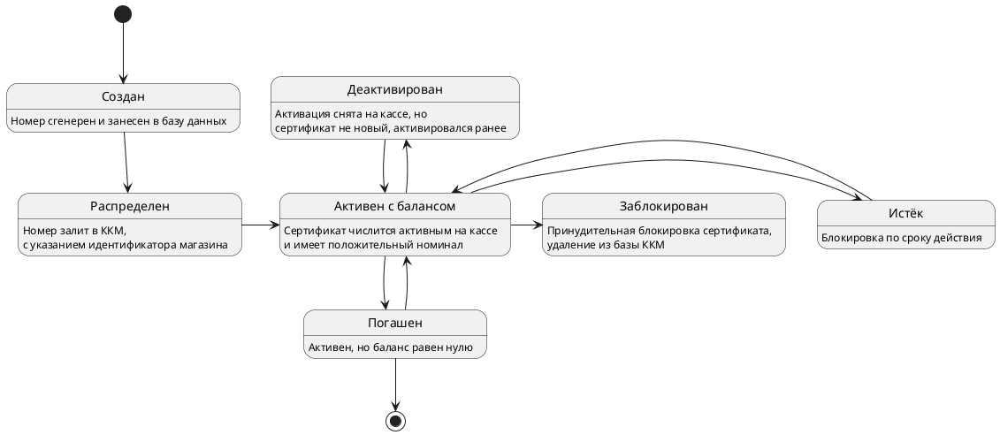

# Обзор

Рассмотрим на примере состояний подарочной карты, которая может содержать два типа состояний:

## Пример диаграммы состояний (State )

Состояния подарочной карты = доступность счета

| status_id | 	status             | 	status_description                                                    |
|-----------|---------------------|------------------------------------------------------------------------|
| 1         | 	Создан             | 	Номер сгенерен и занесен в базу данных                                |
| 2         | 	Распределен	       | Номер залит в УКМ, выставлен магазин                                   |
| 4         | 	Активен с балансом | 	Сертификат числится активным на кассе и имеет положительный номинал   |
| 5         | 	Деактивирован      | 	Активация снята на кассе, но сертификат не новый, активировался ранее |
| 6         | 	Заблокирован       | 	Принудительная блокировка сертификата, удаление из базы УКМ           |
| 7         | 	Погашен	           | Активен, но баланс равен нулю                                          |
| 8         | 	Истёк	             | Блокировка по сроку действия                                           |

