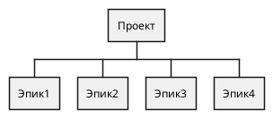
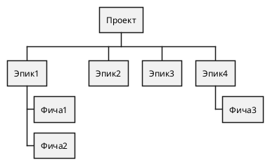
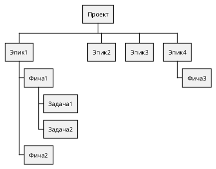

# Обзор WBS

Иерархическая структура работ (WBS - Work Breakdown Structure), или структура декомпозиции, представляет собой схему, где задачи проекта отражают их отношение друг к другу и к проекту в целом.

WBS основана на графическом представлении, что помогает предсказать результаты, основанные на различных сценариях. Процесс часто описывается как структура ветвления, которая охватывает все этапы проекта в организованном порядке.
WBS также может быть представлена в виде табличного списка задач и элементов в плане разбивки работ диаграмм Ганта.

Менеджеры используют структуру декомпозиции, чтобы структурировать и делить проекты на легко управляемые компоненты. Они, в свою очередь, разделяются до тех пор, пока они не назначаются конкретному специалисту в команде.

## Почему стоит использовать WBS

Помогает правильно организовать проекты;
Оказывает помощь в описании содержания проекта для заинтересованных сторон;
Помогает распределить обязанности;
Показывает основные этапы проекта и все ракурсы контроля;
Позволяет правильно оценить затраты, риски и время работ.

## Кому будет интересна WBS

| Роль                                      | Ценность                                                                                                                |
|-------------------------------------------|-------------------------------------------------------------------------------------------------------------------------|
| Менеджеры проектов Менеджеры продукта | Декомпозиция сложных задач на мелкие и обозримые; Повышение точности оценки трудоемкости                            |
| Руководители                              | Понимание и планироение загрузки отдела, бюджета и сроков                                                               |
| Топ-менеджемент                           | Отслеживание изменений и оценка эффективности ключевых проектов Принятие решений о развитии или прекращении проекта |

## Пример WBS с использованием PlantUml
Чтобы перейти к примеру определися какие шаги необходимо выполнить:

### 1. Описание проекта
Предложение или абзац, описывающий концепт и функции проекта после завершающей стадии. Эта стадия WBS представляет собой основу любого проекта и, как правило, разрабатывается всей командой.

### 2. Выделите ключевые этапы
Вероятно придется делить задачу на множество этапов в зависимости от характера вашего проекта. Как правило, это зависит от требований, возможностей бюджета и временных рамок.

### 3. Определите конечные результаты
Сформулируйте для себя все моменты, которые должны быть завершены в течение каждого этапа. Все они должны иметь конечные результаты. Вы должны их достичь полностью, прежде чем перейти к следующему этапу. Каждый конечный результат также должен иметь свое описание, цели и функции.

### 4. Разделите конечные результаты на управляемые задачи
После создания списка конечных результатов добавьте еще один уровень иерархии для расчета деталей. Задачи проекта должны быть выполнены в виде секций. Любой член команды или небольшая команда будет иметь возможность легко управлять ими.

### 5. Распределите задачи в команде
Назначение ответственного за каждую часть работ является последней стадией иерархии. Конкретный специалист будет отвечать за конкретную задачу, будет участвовать в каждом этапе работы, что приведет к качественным результатам.

### Табличное представление WBS

| Epic      | Feature       | Исполнитель  | Best case | Worth case |
|-----------|---------------|--------------|-----------|------------|
| Эпик1     | Фича1         | Исполнитель1 | NDF       | NDF        |
| Эпик1     | Фича1.Задача1 | Исполнитель2 | 1         | 2          |
| Эпик1     | Фича1.Задача2 | Исполнитель2 | 3         | 5          |
| Эпик1     | Фича 2        | Исполнитель1 | 7         | 14         |
| Эпик2     |               | Исполнитель1 | 14        | 21         |
| Эпик3     |               | Исполнитель1 | 7         | 14         |
| Эпик4     | Фича13        | Исполнитель2 | 7         | 10         |
|           |               |              | Best case | Worth case |
| **Итого** |               |              | 39        | 66         |

Одной оценки трудоемкости недостаточно, учтем коммуникации между командами:

| Команда          | Тематика                           | Best case | Worth case |
|------------------|------------------------------------|-----------|------------|
| Менеджемент      | Управление проектом                | 6         | 10         |
| Менеджемент      | Сбор требований                    | 12        | 20         |
| Разработка       | Технические встречи \ Ревью        | 40        | 60         |
| Разработка       | Изучение документации              | 2         | 3          |
| QA + DevOps      | Тестирование                       | 8         | 21         |
| QA + DevOps      | Публикация в прод                  | 3         | 16         |
|                  |                                    | Best case | Worth case |
| **Итого**        | Кросс-функционально взаимодействие | 71        | 130        |
|                  | План исполнения проекта            | 39        | 66         |
| **Общая оценка** | **трудоемкости проекта**           | 110       | 196        |

### Что дальше?

WBS позволяет увидеть весь объём работ, чётко определить, что и кем должно быть сделано, а также оценить трудозатраты и ресурсы.

Стоит понимать, что это лишь общая и предварительная оценка проекта, дальше следует переходить к краткосрочному и среднесрочному планированию, уточнять данные оценки и составлять календарные планы исполнения.

Связь календарного планирования с общей оценкой и понимание взаимосвязей повысит точность оценки проектов, поможет сократить time2market и достичь ожидаемого эффекта.

*[WBS]: Work Breakdown Structure
*[NDF]: Not Defined, Не определено, эквивалент ToBeDone (TBD)
*[time2market]: время от возникновения идеи до вывода ее на рынок